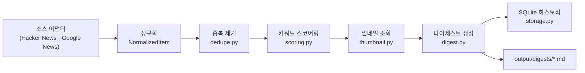
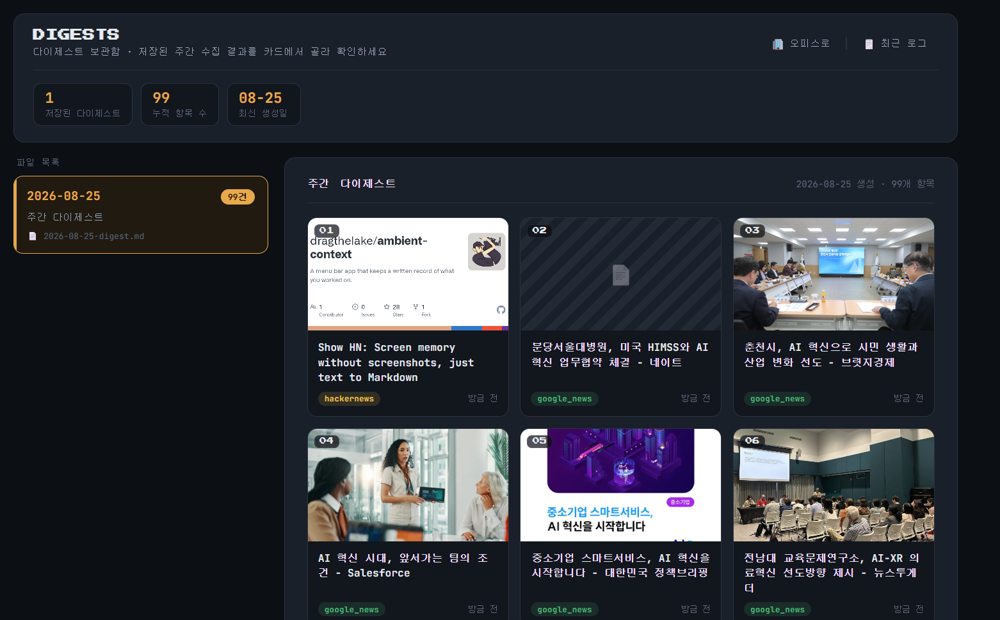

# my-ai-team — 관심분야 정보 수집기

관심 키워드(**Claude · LLM 에이전트 · AI · AI 혁신**)를 다루는 뉴스를 RSS/API로 자동 수집해, 중복을 걸러내고 점수를 매긴 뒤 주간 마크다운 다이제스트로 정리해주는 개인용 정보 수집 파이프라인입니다.

Claude Code의 **Git Worktree + Subagent 병렬 개발**, **Hooks**, **Skill**을 실전에 적용해보는 실습 프로젝트로 시작해, 지금은 실제로 매주 쓰는 도구가 되었습니다.

## 주요 기능

- **다중 소스 수집** — Hacker News, Google News(키워드 검색) 어댑터
- **정규화 · 중복 제거 · 키워드 스코어링** — 실행 간 누적된 히스토리를 기준으로 중복을 제거
- **기사 썸네일** — 각 기사의 OG 이미지를 가져와 다이제스트를 뉴스카드처럼 표시 (Google News 리다이렉트 링크도 실제 언론사 주소로 해석해서 처리)
- **SQLite 히스토리** — 수집 이력과 생성된 다이제스트를 누적 저장
- **가상 오피스 대시보드** — Claude Code Hooks가 보고하는 에이전트 상태를 실시간으로 시각화하는 로컬 웹 UI, 버튼/클릭 한 번으로 파이프라인 실행

## 아키텍처



## 빠른 시작

```bash
git clone https://github.com/anhyoin97/my-ai-team.git
cd my-ai-team
python3 -m venv .venv
source .venv/bin/activate
pip install -e ".[dev]"

# config.yaml에서 소스/키워드 확인 후 파이프라인 실행
python3 scripts/run_pipeline.py

# 가상 오피스 대시보드 (실시간 상태 + 온디맨드 실행 + 다이제스트 뷰어)
python3 scripts/office_server.py
# → 브라우저에서 http://localhost:<포트>/dashboard.html
```

## 스크린샷

실제 수집 결과가 반영된 다이제스트 뉴스카드 화면입니다.



## 프로젝트 구조

```
src/collector/
  adapters/        # 소스별 어댑터 (hackernews, google_news)
  models.py        # RawItem / NormalizedItem
  dedupe.py        # 중복 제거
  scoring.py        # 키워드 스코어링
  thumbnail.py      # 기사 썸네일(og:image) 조회
  storage.py        # SQLite 히스토리
  digest.py         # 마크다운 다이제스트 생성
scripts/
  run_pipeline.py    # 파이프라인 엔드투엔드 실행
  office_server.py   # 가상 오피스 대시보드 서버
.claude/
  hooks/             # 커밋 품질 게이트 + 에이전트 상태 보고 Hooks
  skills/            # 어댑터 테스트 작성 표준 Skill
config.yaml          # 소스 / 키워드 / 스코어링 설정
```

## 개발

```bash
ruff check .
mypy src
pytest -q
```

`git commit` 시 `.claude/hooks/quality-gate.sh`가 ruff · mypy · pytest를 자동 실행해, 실패하면 커밋 자체를 막습니다.

## 더 알아보기

이 프로젝트를 만들며 거친 단계별 과정, 마주친 버그와 해결 과정, 회고는 [Notion 문서](https://app.notion.com/p/3c47159219578040bf0dc9e324e95953)에 상세히 정리되어 있습니다.
